# WEBGIS-RESPONSI
Project Responsi - Alya Syahidha - 22/505809/SV/21946

---

> **TERNAKSLEMAN**

> Deskripsi Produk :
Ternaksleman adalah sebuah aplikasi berbasis web yang ditujukan untuk mengajak kalangan muda-mudi memulai perjalanan beternak! Kami ingin mengenalkan dunia peternakan kepada para kalangan, sehingga peternakan di Indonesia khususnya Sleman memiliki kualitas ternak yang baik dan sesuai standar pemerintah.

> Komponen Pembangun Produk :
Leaflet.JS, Bootstrap, Database, GeoJSON, Shapefile, Data BPS, Data Google Maps.

> Sumber Data :
PhpMyAdmin (*database*), Data BPS (https://slemankab.bps.go.id/), Geoportal (https://geoportal.slemankab.go.id/).

> Komponen Penting Produk :

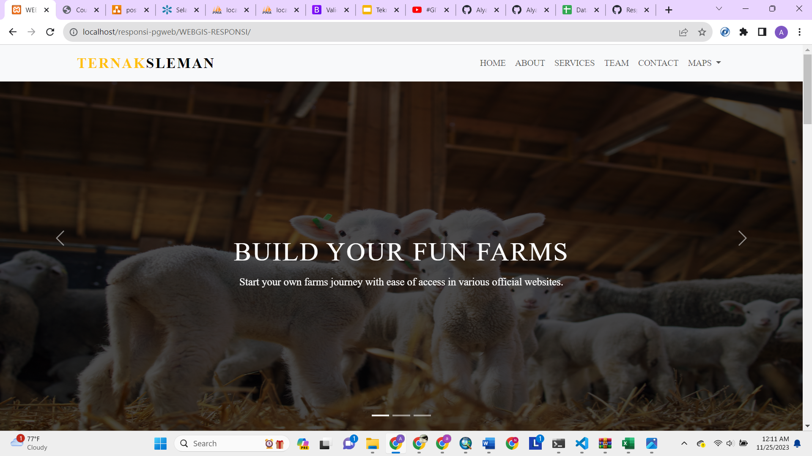
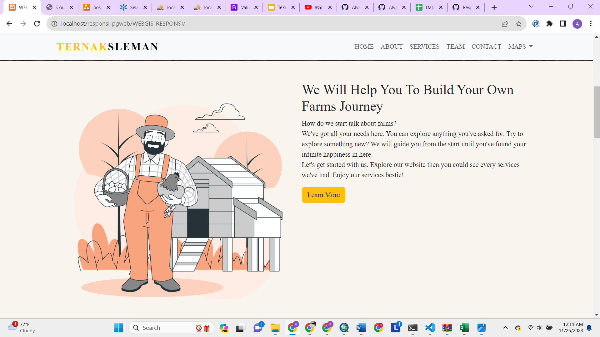
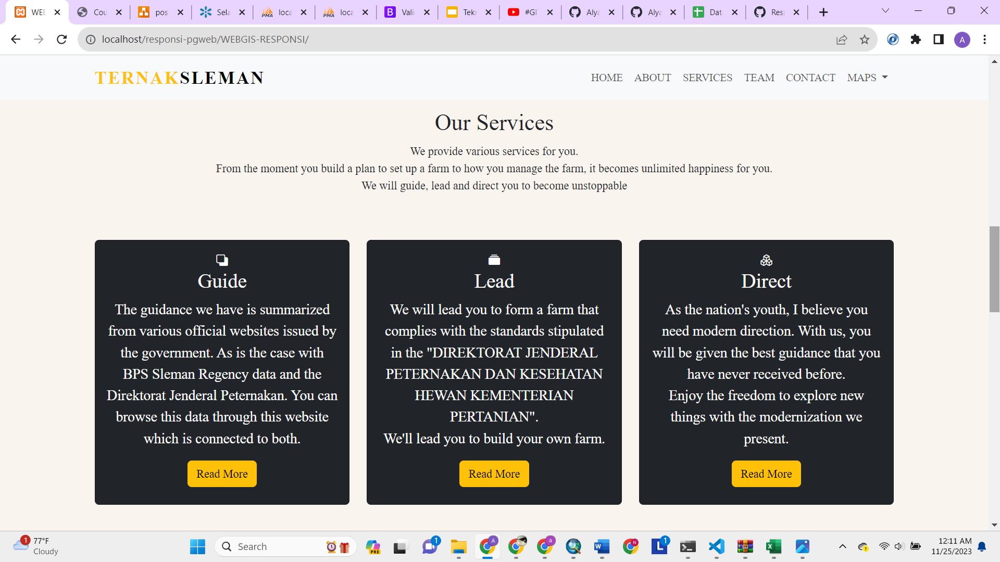
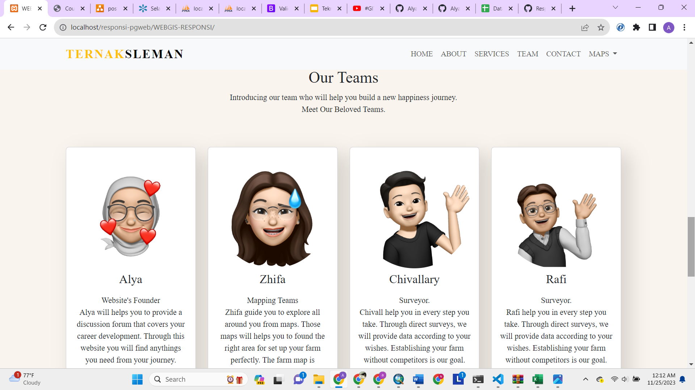
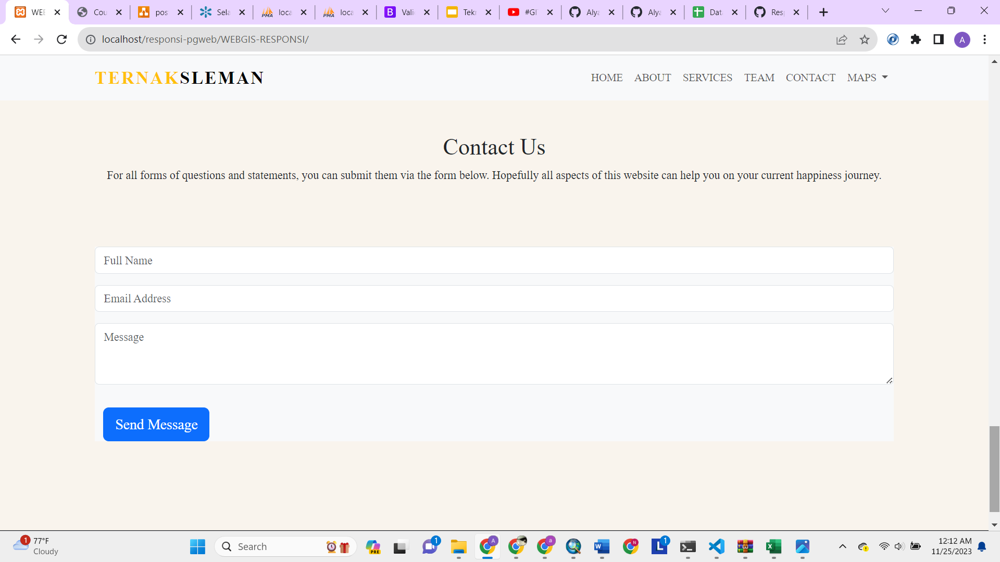
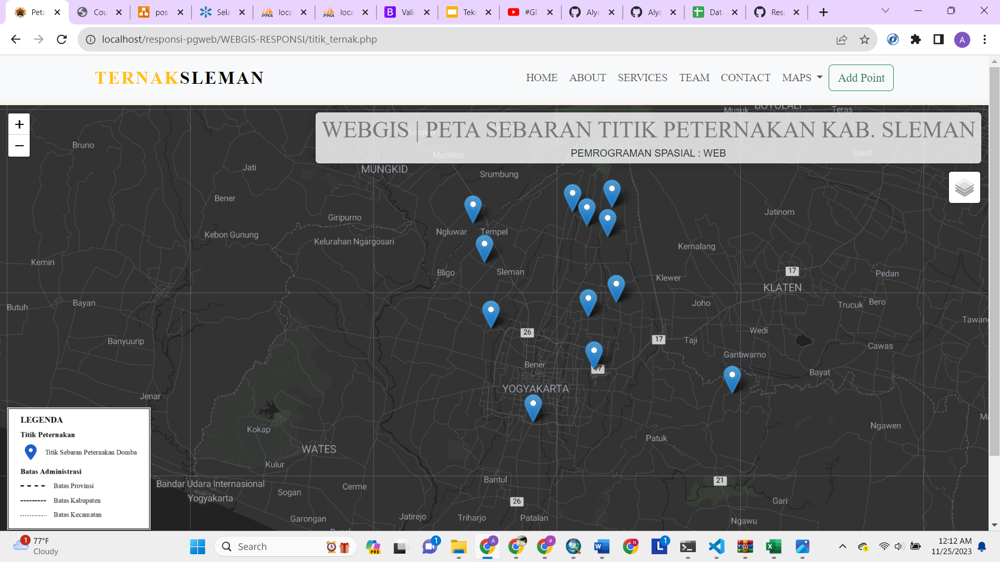
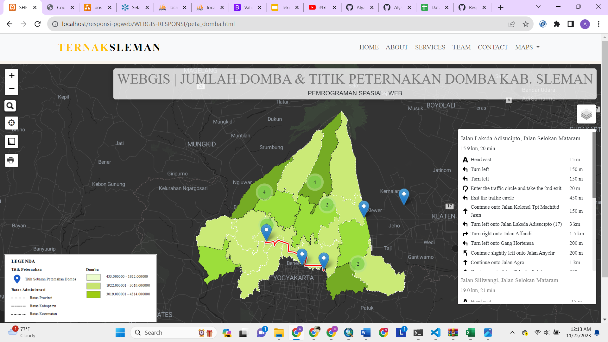
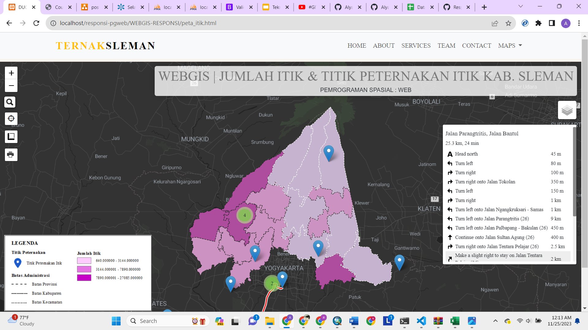
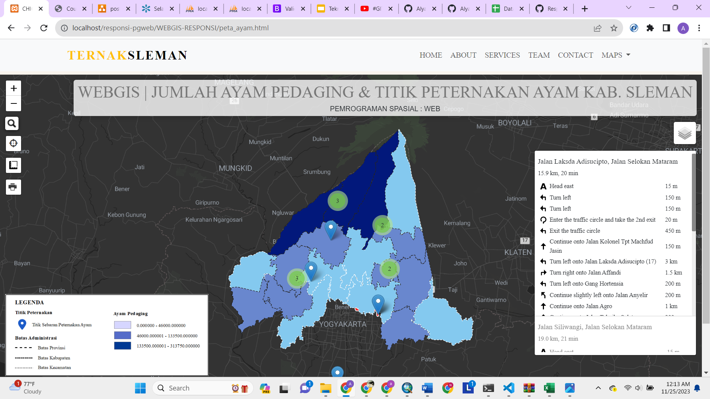
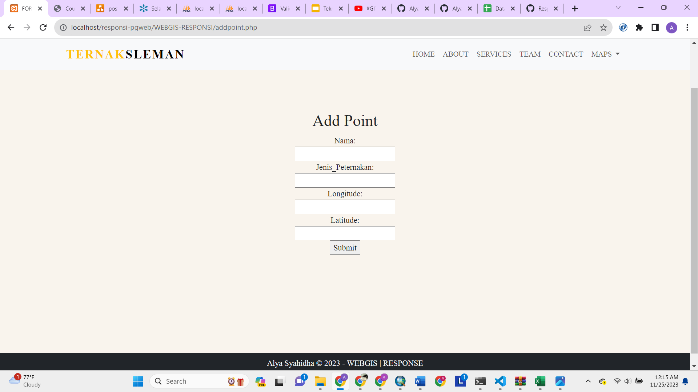

> Profil :

Nama : Alya Syahidha

NIM  : 22/505809/SV/21946

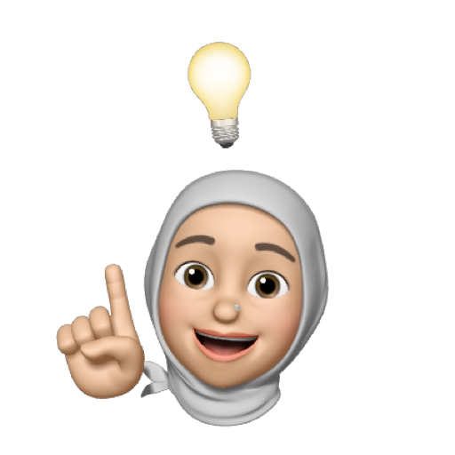